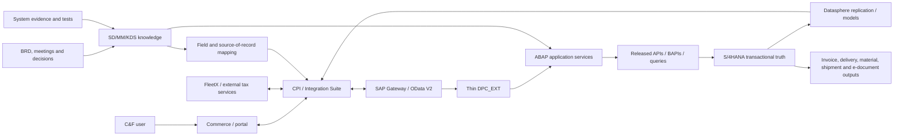
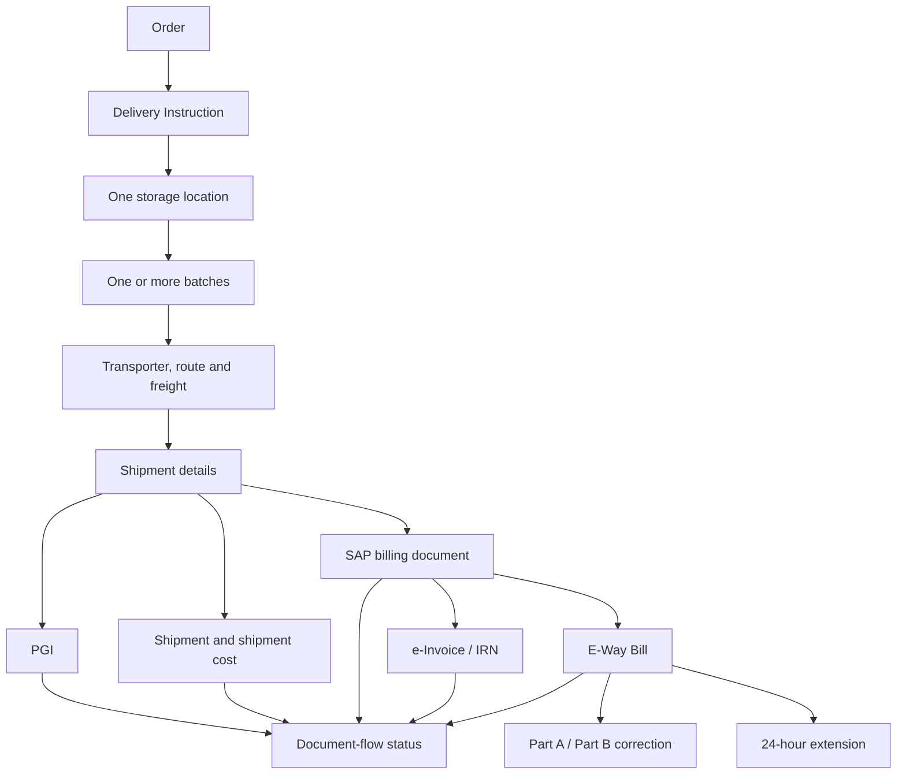
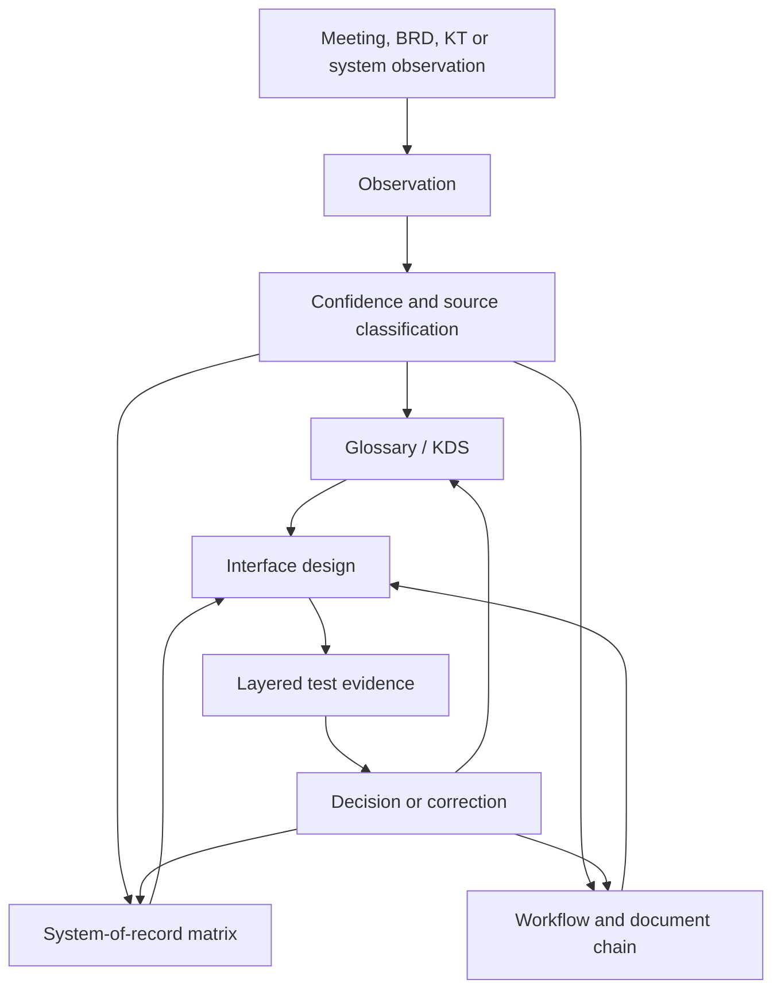

# Brain Map

## Operational spine

The arrows express the desired business journey, not yet the verified SAP call sequence. PGI, shipment, billing, and e-document ordering/atomicity remain open.

## Knowledge loop

